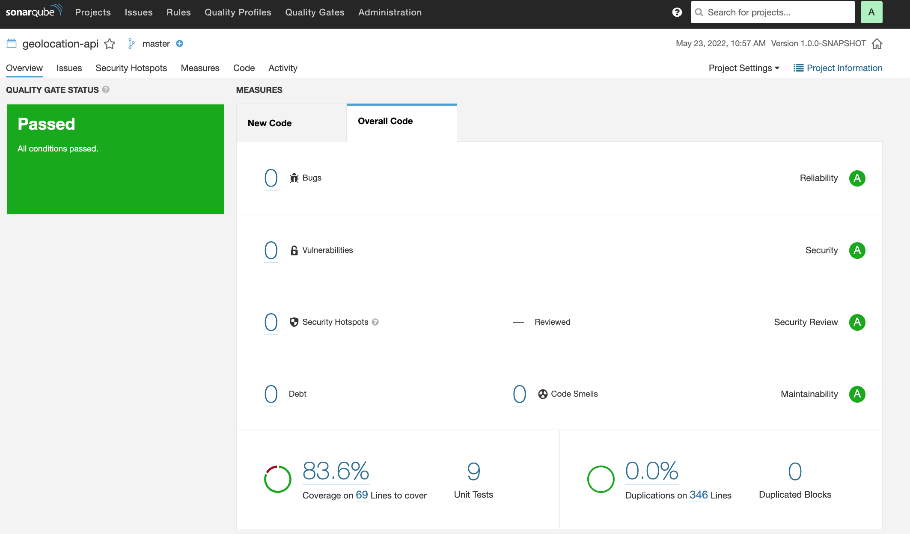

# geolocation-api Project

This project uses Quarkus, the Supersonic Subatomic Java Framework.

If you want to learn more about Quarkus, please visit its website: https://quarkus.io/ .

## Prerequisites

- JDK 11 or 17 (tested with OpenJDK/Temurin)
- Maven 3.8.4 or more (can be skipped if you use ./mvnw instead of mvn)

If you are using Linux, macOS or WSL 2, I greatly recommend that you use SDKMAN if you plan on developing java
applications. It's a JDK manager that allows you to switch JDK version on the fly. https://sdkman.io/

There is a way to run the application without the prerequisite by running the compilation in docker if you choose to use
a native executable. The
caveat is that this operation is very resource heavy and needs more memory that a usual CI worker usually has. I will
share the commands later in this document.

## How to use

Quarkus is a fantastic framework that prefer to use existing libraries rather than rewriting the wheel. This allows us
to use
services like OpenAPI and Swagger by simply adding the extension to the pom.xml file.

Here is a list of useful urls that
are available in dev mode. Some of them are also available in production.

- Swagger (also available in prod) http://localhost:8080/swagger/
- Health check http://localhost:8080/q/health-ui/
- The main dev UI http://localhost:8080/q/dev/

## Running the application in dev mode

You can run your application in dev mode that enables live coding using:

```shell script
./mvnw compile quarkus:dev
```

> **_NOTE:_**  Quarkus now ships with a Dev UI, which is available in dev mode only at http://localhost:8080/q/dev/.

## Packaging and running the application

The application can be packaged using:

```shell script
./mvnw package
```

## Running the app in a docker container

Fortunately for me, Quarkus automatically made dockerfiles for me when I generated the project. Here is how to use the
fast jar version of the app.

```shell script
 ./mvnw package
 docker build -f src/main/docker/Dockerfile.jvm -t quarkus/geolocalization-api-jvm .
 docker run -i --rm -p 8080:8080 quarkus/geolocalization-api-jvm
```

I also made a Docker-compose file to make it easier to run.

```shell script
./mvnw package
docker build -f src/main/docker/Dockerfile.jvm -t quarkus/geolocalization-api-jvm .
docker-compose up -d
```

## Creating a native executable (the way to skip the prerequisites)

~~You can create a native executable using:~~

~~./mvnw package -Pnative~~

Or, if you don't have GraalVM installed, you can run the native executable build in a container using:

```shell script
./mvnw package -Pnative -Dquarkus.native.container-build=true
docker build -f src/main/docker/Dockerfile.native-micro -t quarkus/geolocalization-api .
docker-compose -f docker-compose.native.yml up -d
```

If you want to learn more about building native executables, please consult https://quarkus.io/guides/maven-tooling.

## What could be done better

- The error handling does not really go in details for each error.
- I wasted a bunch of time trying to package the GEO2Lite database into the jar and never figured it out. If it had
  worked, the app would not have to do http calls to their service, and we could use caching on the database to make the
  queries faster. It is still possible to use caching on services using quarkus but that way beyond the scope of this
  technical Test.
- I could have gone above and beyond and make tests for every class, but I think that testing the endpoint is enough
  for this test. I used SonarQube to make sure I did not have any obvious code smell and got a code coverage of over
  80%.
  

## Related Guides

- SmallRye OpenAPI ([guide](https://quarkus.io/guides/openapi-swaggerui)): Document your REST APIs with OpenAPI - comes
  with Swagger UI
- Jacoco - Code Coverage ([guide](https://quarkus.io/guides/tests-with-coverage)): Jacoco test coverage support
- SmallRye Health ([guide](https://quarkus.io/guides/microprofile-health)): Monitor service health
- Error handling ([stackoverflow](https://stackoverflow.com/questions/60008540/quarkus-exception-handler))
- Quarkus guide on making imperative rest api ([guide](https://quarkus.io/guides/rest-json))
- Quarkus guide on using config Properties. Although, I never ever got it to work by using the
  annotations. ([guide](https://quarkus.io/guides/config))
- Quarkus guide on native executables ([guide](https://quarkus.io/guides/building-native-image))